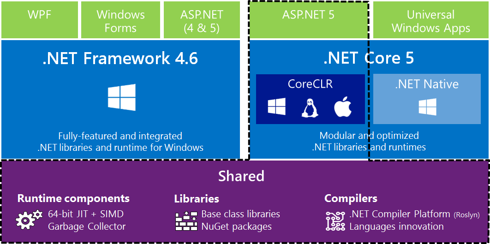
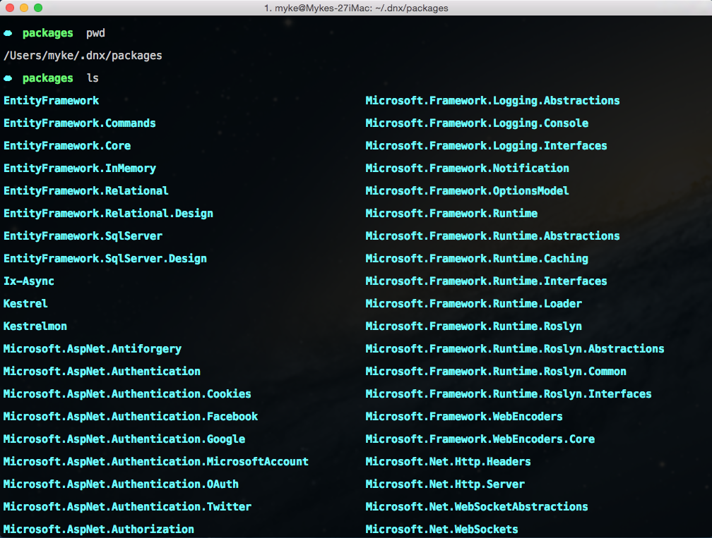
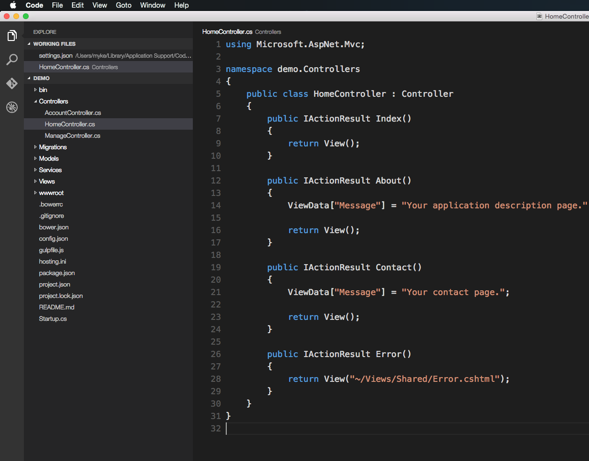

slidenumbers: true

# Cross-Platform .NET Development


---

# [fit]BIG DEAL

---


---

# Pff, Macs and Linux.  Why should we care?

---

- New workflows and technologies
- New market opportunities
- Platform diversification
- Server consolidation(less of $$$)
- New developers
- New era

---


## Open Source
## Cross-Platform
## Slimmed Down
## Extra Awesome

---



---

# .NET Core
- Modular runtime and library implementation
- Includes a subset of the .NET Framework
- OS X and Linux still in progress
- Distributed via NuGet
- Portable

---

# Open Source
- Unprecedented early access
- Help provide direction
- Transparency

---

# [fit] BETA
#### Seriously

---

# Running Windows?
## Install latest and done
### It just works


---

# Note
## Even if you are running Windows the new hotness can still optionally apply

---

# On a Mac?
## It just wor... n/m ಠ_ಠ


---


## File -> New Project
### ...Not so fast


---


---

# Command Line Tools
- Homebrew
- Node.js + NPM
- Yeoman
- DNVM
- DNX
- DNU
- Hipster Cred

---

# Homebrew
```bash
ruby -e "$(curl -fsSL https://raw.githubusercontent.com/Homebrew/install/master/install)"
```

---

# Node.js


---

## OR
## `brew install node`

---

# Yeoman

`npm install -g yo`
<br>
`npm install -g generator-aspnet`


---

# Brew Tap

```bash
brew tap aspnet/dnx
brew update
brew install dnvm
```
<br>

Add dnvm to your bash profile<br>(./bash_profile)
`source dnvm.sh`


---


---

# DNVM
## .NET Version Manager
- Download versions of .NET Execution Environment(DNX)
- Easily switch between DNX versions

---

# DNX
## .NET Execution Environment
- Contains the code required to bootstrap and run an application - `dnx . kestrel`
- If installed with DNVM, DNX is in your path
- No more "design time" (blur the lines between compilation and loading)...
- Run custom commands

---

# DNU
## DNX Utility
- Responsible for all operations involved with packages in your application.
- Restore, Install, Publish, Build, List, etc

---

# yo aspnet
- Empty Application
- Console Application
- Web Application
- Web Application Basic [without Membership and Authorization]
- Web API Application
- Nancy ASP.NET Application
- Class Library
- Unit test project


---

# Yo, what's up
- Equivalent to a File->New Project
- Bootstraps the project template with fresh files
- Gulp - swappable with Grunt
- Default config and tasks
- Ready to rock and roll

---

# dnu restore
# dnu build

---


---

# Note
If you have previously installed the Yeoman aspnet generator you will want to make sure you run the install again to get the latest version
<br>
`npm install -g generator-aspnet`

---

# NuGet Packages
## Where are they?
### ~/.dnx/packages

---



---

# dnx . kestrel
## AKA F5

---


---

# Current Pitfalls
- Bugs, obviously
- No debugging
- Heavy reliance on Mono
- No data persistence
- No auto compilation[^1]
- ~~Kestrel difficult to kill~~

[^1]: [GitHub Issue](https://github.com/aspnet/dnx/issues/1795)

---

# Visual Studio Code
- More text editor then IDE
- Extremely lightweight & fast
- Clean and minimal UI
- Intellisense
- Actually formats code well
- Flexible
- JavaScript
- Git
- Commands & Tasks



---

# Let's see something real
- Add [Json.NET](http://www.newtonsoft.com/json) to project.json
- Run a restore
- Setup a quick home route to return some json
- Run kestrel to see result

---


---

# Tip
Until auto compilation is working properly via dnx you can use a [technique](https://github.com/johnpapa/aspnet5-starter-demo#dnxmon) suggested by [John Papa](https://github.com/johnpapa/)

And then run dnxmon . kestrel

This will automatically restart kestrel on file save

---

# Roadmap
Beta7 - Cross-platform - Aug 24

The primary focus for Beta7 will be to enable cross-platform development on .NET Core. This includes shipping the .NET Core based .NET Execution Environments for Mac and Linux, enabling the basic developer workflows and also setting up the acquisition story.

Planned features: Runtime, MVC, Razor, Identity

---

# Roadmap
Beta8 - Feature complete! - Sept 21

Beta8 is the last major feature milestone planned before moving into a stabilization phase for RC1. We will work on enabling complete end-to-end experiences in Visual Studio and Visual Studio Code. We expect cross-platform .NET Core to be feature complete at this point.

Planned features: Runtime, MVC, Razor, Identity

---

# Roadmap
RC1 - Stabilization - Nov

The focus for RC1 will be on polishing existing features, responding to customer feedback and improving performance and reliability. The goal is for RC1 to be a stable and production ready release.

---

# Roadmap
Future Work

The following features unfortunately won't make it into the initial RTM release. We are tentatively planning on shipping them in the initial feature release after RTM, during Q3* of 2016:

Visual Basic support, SignalR 3, Web Pages 4

---

# Future for ASP.NET development

---

# Future for ASP.NET development
- More desirable for those reluctant devs
- Huge advantage for CMSs and other platforms
- Alternative workflows
- New tooling otherwise never available in Windows


---

# Resources
[ASP.NET Github](https://github.com/aspnet)
[.NET Core](http://dotnet.github.io/core/)
[.NET Core Documentation](http://dotnet.readthedocs.org/en/latest/)
[.NET Foundation Projects](http://www.dotnetfoundation.org/projects)
[Visual Studio Code](https://code.visualstudio.com/)
[API Portability Analyzer](https://www.microsoft.com/en-us/download/details.aspx?id=42678)
[Music Store Project](https://github.com/aspnet/MusicStore)
[Music To Code To - Carl Franklin](http://mtcb.pwop.com/)